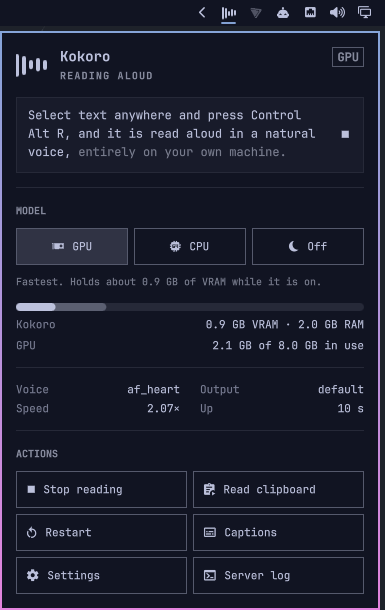
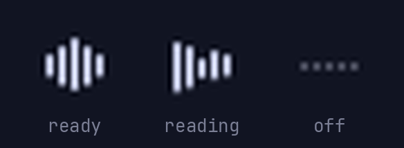

# Kokoro Read-Aloud

Select text anywhere, press **Ctrl+Alt+R**, and it is read aloud in a natural
voice. Everything runs on your own machine. A small local server keeps the
[Kokoro-82M](https://huggingface.co/hexgrad/Kokoro-82M) model loaded and starts
speaking while the rest of the text is still being synthesized. Nothing leaves
the machine, and the clipboard is never polled.

It runs on Windows 11 and on Linux: Fedora with GNOME, and Omarchy with
Hyprland, both on Wayland.

> **Status.** The last tagged release is `v0.1.0-beta`, and it is Windows only.
> Linux support, the caption strip and the Omarchy bar widget are on `main`
> and untagged. Audio is stable and in daily use. The rough part is the Windows
> in-place highlighter, see [Known issues](#known-issues).

## What you get

- **Three hotkeys.** They work wherever text can be selected, including
  terminals and PDFs.

  | Keys | Action |
  |---|---|
  | `Ctrl+Alt+R` | Read the selection |
  | `Ctrl+Alt+T` | Read the clipboard as-is |
  | `Ctrl+Alt+S` | Stop |

- **Fast, steady speech.** On an RTX 4060 Ti, speech starts about a tenth of
  a second after the server gets the text. On a CPU it takes a few tenths. Text
  is split at commas and full stops wherever it can be, so pauses fall where
  the sentence has them. The speed-up keeps the voice's pitch.
- **Your place in the text.** Windows tints the spoken word in the app
  itself. A caption strip works on both platforms, and a Chromium extension
  marks the word inside web pages.
- **A settings panel** for voice, speed, pauses and output device. It knows how
  fast your machine can synthesize, and warns you before you pick a speed it
  cannot keep up with.
- **An Omarchy bar icon** that frees the model's VRAM when a game or a local
  LLM needs it, or moves the model to the CPU.
  [See below](#omarchy-bar-widget).

## Install

There is one download for every platform. The scripts locate themselves, so any
folder works, and the code detects which desktop it is on. Only the install steps
differ:

| Platform | Desktop | Section |
|---|---|---|
| Windows 11 | | [Windows](#windows) |
| Fedora 44 | GNOME on Wayland | [Linux: Fedora (GNOME)](#linux-fedora-gnome) |
| Omarchy 4 (Arch) | Hyprland | [Linux: Omarchy (Hyprland)](#linux-omarchy-hyprland) |

Two things apply everywhere:

- **Python 3.12 exactly.** `kokoro` declares `Requires-Python >=3.10,<3.13`.
  On 3.13 or newer, pip filters out every usable wheel and reports a missing
  package instead (see [Troubleshooting](#troubleshooting)). A newer Python
  can be installed alongside, as long as the venv is not built from it.
- **One requirements file.** Install `requirements-cuda.txt` if you have an
  NVIDIA GPU, otherwise `requirements.txt`. Never install both: Kokoro uses
  whichever torch build is present.

The first run downloads the ~330 MB Kokoro-82M model, plus a ~13 MB spaCy
model that `misaki` fetches the first time it phonemizes.

### Windows

Install [AutoHotkey v2](https://www.autohotkey.com/) first, either per-user or
machine-wide. The hotkeys come from it, and nothing else provides them.
You don't need to install eSpeak NG: `espeakng-loader`, pulled in by
`misaki[en]`, ships the DLL and its data inside the venv.

```powershell
git clone https://github.com/sayed-qutob-work/kokoro-read-aloud.git
cd kokoro-read-aloud
py -3.12 -m venv env
env\Scripts\python.exe -V          # must print 3.12.x

# NVIDIA GPU:
env\Scripts\python.exe -m pip install -r requirements-cuda.txt
# otherwise:
env\Scripts\python.exe -m pip install -r requirements.txt

env\Scripts\python.exe tts_server.py
```

Wait for `[kokoro] ready on http://127.0.0.1:5111`. Then start `read_aloud.ahk`,
select some text and press Ctrl+Alt+R.

To start everything at login, put a shortcut to `start_tts.vbs` in
`shell:startup`. It launches the server, hotkeys, highlighter and tray icon,
all hidden, and logs the server to `server.log`.

PowerShell traps: use `py -3.12 -m venv`, not `python -m venv`. Use
`env\Scripts\python.exe -m pip`, never bare `pip`. Quote version specs
(`"kokoro>=0.9.4"`), because `>` is a redirect in PowerShell.

### Linux: Fedora (GNOME)

Tested on Fedora 44. Other distributions should work but have not been tried.

```bash
sudo dnf install python3.12 python3.12-devel python3.12-tkinter python3-tkinter \
                 python3-xlib portaudio espeak-ng wl-clipboard jq curl

git clone https://github.com/sayed-qutob-work/kokoro-read-aloud.git
cd kokoro-read-aloud
python3.12 -m venv env
env/bin/python -V                  # must print 3.12.x

# NVIDIA GPU (needs the RPM Fusion akmod-nvidia driver):
env/bin/python -m pip install -r requirements-cuda.txt
# otherwise:
env/bin/python -m pip install -r requirements.txt

env/bin/python tts_server.py       # first run downloads the models; Ctrl+C once it says ready
```

`python3-xlib` is for the system Python, not the venv. GNOME 50.5 stopped
giving `wl-paste` the focus it needs to read the selection, so `read_aloud.sh`
reads it through Xwayland instead (`linux/xselection.py`). Without the package
it falls back to `wl-paste`, and reads stall for seconds.

Then the installers. Each one is per-user and needs no root. Re-run them after
moving the folder, because they bake in the paths.

```bash
linux/install-systemd.sh     # autostart: kokoro-server enabled, caption strip opt-in
linux/install-desktop.sh     # "Kokoro Settings" in the app grid
```

Bind the hotkeys in Settings > Keyboard > View and Customize Shortcuts > Custom
Shortcuts, with absolute paths:

| Shortcut | Command |
|---|---|
| Ctrl+Alt+R | `/path/to/kokoro-read-aloud/read_aloud.sh selection` |
| Ctrl+Alt+T | `/path/to/kokoro-read-aloud/read_aloud.sh clipboard` |
| Ctrl+Alt+S | `/path/to/kokoro-read-aloud/read_aloud.sh stop` |

`read_aloud.sh` reads the PRIMARY selection instead of copying. Wayland
gives a background process no way to send Ctrl+C to another app, and this way
the clipboard is never touched.

There is no tray icon on GNOME. GNOME removed the notification area. An
indicator would need the AppIndicator extension plus PyGObject, and Fedora
builds PyGObject only for its system Python (3.14), while this venv must be 3.12.
The settings panel opens from the app grid, or with
`env/bin/python tray.py --settings`.

### Linux: Omarchy (Hyprland)

Tested on Omarchy 4.0.4 (Arch, Hyprland 0.56.2) with an NVIDIA GPU. The Linux
scripts are the same as on Fedora. Three things differ:

- **Python 3.12 has to be compiled, not downloaded.** Arch ships only 3.14.
  mise's prebuilt 3.12 installs fine, but its bundled Tk has no Xft and sees
  exactly one bitmap font, so the settings panel and caption strip render in
  tiny text. A 3.12 built against Arch's own `tk` avoids this, and takes
  about a minute to build.
- **The hotkeys are Hyprland binds**, written by `linux/install-hyprland.sh`.
- **Fewer packages.** There is no `espeak-ng`, because `espeakng-loader`
  ships a working library in the venv. There is no `python-xlib`, because
  Hyprland gives `wl-paste` the selection directly (`read_aloud.log` shows
  `via=wl`).

```bash
sudo pacman -S --needed base-devel tk portaudio wl-clipboard jq curl libnotify

# If mise already has a prebuilt 3.12, `mise uninstall python@3.12` first.
MISE_PYTHON_COMPILE=1 mise install python@3.12

git clone https://github.com/sayed-qutob-work/kokoro-read-aloud.git
cd kokoro-read-aloud
"$(mise where python@3.12)/bin/python3.12" -m venv env
env/bin/python -V                  # must print 3.12.x
env/bin/python -c "import tkinter as t; r = t.Tk(); r.withdraw(); print(r.tk.call('::tk::pkgconfig', 'get', 'fontsystem'))"
                                   # must print xft

# NVIDIA GPU:
env/bin/python -m pip install -r requirements-cuda.txt
# otherwise:
env/bin/python -m pip install -r requirements.txt

env/bin/python tts_server.py       # first run downloads the models; Ctrl+C once it says ready
```

Don't remove that Python with mise later. The venv links to it, so
`mise uninstall` or `mise prune` would break it.

Then the installers. Each one is per-user and needs no root. Re-run them after
moving the folder.

```bash
linux/install-systemd.sh     # autostart: kokoro-server enabled, caption strip opt-in
linux/install-desktop.sh     # "Kokoro Settings" in the app launcher (Super+Space)
linux/install-hyprland.sh    # Ctrl+Alt+R / T / S, plus a rule that centres the settings panel
linux/install-omarchy.sh     # the bar icon, see the next section
```

`install-hyprland.sh` writes `~/.config/hypr/kokoro.lua` and adds one
`dofile(...)` line for it to `~/.config/hypr/hyprland.lua`, after backing that
file up. Then it reloads Hyprland and stops if Hyprland reports config errors.
If you already bound `read_aloud.sh` by hand, it lists where. Remove those
binds, or every press fires twice. To undo it, delete the `dofile` line and
`kokoro.lua`.

Notes:

- **Caption strip monitors** come from `hyprctl monitors`. Hyprland has no
  primary monitor, so "Primary monitor" in Settings means the first one it
  lists. Pick a connector such as `DP-3` to be explicit.
- **`sudo` needs a terminal** for its password prompt. In a shell without
  one, such as a script, an AI agent or Claude Code's `!` prefix, use
  `pkexec`. Omarchy's shell shows the password dialog.

## Omarchy bar widget



On Omarchy, `linux/install-omarchy.sh` puts a Kokoro icon next to the system
tray. It is built from the shell's own components, so it follows your theme
and keyboard conventions like the built-in panels do. The main reason it exists
is to give the GPU back: the server keeps the model loaded all day, and a game or
a local LLM may need that VRAM.



The bars move while it reads, ripple while the model loads, and turn into dim
dots when it is off.

| Input | Does |
|---|---|
| Left click | Open the panel |
| Right click | Turn the model off, freeing its VRAM, or back on |
| Middle click | Stop the current read |
| In the panel | Arrows or `hjkl` move, `Enter` activates, `Esc` closes. `g` / `c` / `o` pick GPU / CPU / Off, `s` stops reading, `r` restarts |

The panel shows:

- **GPU / CPU / Off.** CPU mode restarts the server with the GPU hidden from
  it. It uses no VRAM, and reads keep working.
- **Kokoro's share of the GPU's memory**, next to every other process, plus
  the RAM it holds.
- **The sentence being read**, with the part already spoken shown brighter.
- **The live voice, speed, output device and uptime.**
- **Actions:** stop reading, read the clipboard, restart, captions on/off, open
  Settings, and follow `server.log`.

What each mode costs, measured on an RTX 4060 Ti with an i5-12400F:

| Mode | VRAM | RAM | First sound | Synthesis speed |
|---|---|---|---|---|
| GPU | 0.8 GB after a start, up to 1.6 GB with use | ~2 GB | 0.06–0.1 s | 20–87x realtime |
| CPU | none | 1.5–1.8 GB | 0.35–0.5 s | 4.4–5.3x realtime |
| Off | none | none | n/a | n/a |

Switching to GPU or CPU takes about 6 s, the time it takes to load the model.
Switching off is immediate. On the CPU, a very short first sentence can be
followed by a brief pause, because the next chunk takes longer to synthesize
than the first one takes to play. CPU mode lasts until you log out, and the
next login starts on the GPU again. A hotkey pressed while Kokoro is off shows a
notification and does not start the model, so a game keeps its VRAM.

To update the widget after a `git pull`, re-run `linux/install-omarchy.sh`. If
the widget is already loaded, the installer restarts the Omarchy shell. The
shell's hot-reload keeps the old compiled code, so the restart is what makes
changes show. To remove it:

```bash
omarchy plugin disable io.github.sayed-qutob-work.kokoro-read-aloud
rm -r ~/.config/omarchy/plugins/io.github.sayed-qutob-work.kokoro-read-aloud
```

### From a terminal or a keybind

The widget runs everything through `linux/kokoroctl`. The script also works on
its own, on any Linux system with the `kokoro-server` unit from
`install-systemd.sh`:

```bash
linux/kokoroctl off       # stop the server: VRAM and RAM freed, hotkeys go quiet
linux/kokoroctl cpu       # run on the CPU: no VRAM, reads keep working
linux/kokoroctl gpu       # back on the GPU
linux/kokoroctl restart   # same device as now
linux/kokoroctl status    # JSON: state, device, VRAM/RAM, live config
```

It also takes `stop`, `clipboard`, `captions [on|off|toggle]`, `settings` and
`log`.

## Showing where you are

### In-place highlighting (Windows)

The spoken word is tinted in the original text. How well that works depends on
what each app exposes to accessibility APIs:

| Where | Marker | Notes |
|---|---|---|
| Firefox | yes | Gecko exposes real text geometry |
| Chrome / Edge | yes | Load `extension/` unpacked. In Chromium the extension is the reliable path, not UI Automation |
| Notepad and Win32 editors | yes | |
| VS Code editor | partial | Needs `"editor.accessibilitySupport": "on"` in user settings, or no editor text is exposed at all |
| Obsidian (`.md`) | partial | Works since 2026-08-12 |
| Outlook / Hotmail on the web | partial | Intermittent, undiagnosed (`docs/plan.md` D2) |
| Terminals | no | Not possible, see below |
| PDFs in a browser viewer, Google Docs | no | Drawn to a canvas, with no text geometry to point at |

Terminals draw text to a canvas and expose it to accessibility tools through a
hidden off-screen buffer. The position they report has nothing to do with where
the pixels are. So terminal text can be read aloud, but it can't be highlighted.

In VS Code, the highlighter has to move the cursor, and VS Code then tints every
other occurrence of the word. To turn that off for markdown only:

```json
"[markdown]": {
    "editor.occurrencesHighlight": "off",
    "editor.selectionHighlight": false
}
```

There is no in-place highlighter on Linux. UI Automation is a Windows API and
Wayland has no equivalent, so Linux uses the caption strip. The Chromium
extension only needs the local server, so it should work on Linux too. That is
untested.

### Caption strip

`overlay.py` shows the sentence being read in a strip that appears while speech
plays. It hides about 0.7 s after speech stops. Drag it to move it, right-click
it to close it. It gets the text from the server, so it works for terminals,
PDFs and everything else the in-place highlighter can't reach.

It is off by default. To start it:

- **Linux:** `systemctl --user enable --now kokoro-overlay` to start it at every
  login. On Omarchy you can also use the panel's Captions button.
- **Windows:** `env\Scripts\pythonw.exe overlay.py`.

All of its options are in the Settings panel:

| Setting | Values | |
|---|---|---|
| `caption_layout` | `teleprompter`, `rows` | Teleprompter wraps the whole passage and scrolls it past a fixed reading line. Rows is a static three-line strip |
| `caption_scroll` | `continuous`, `line`, `off` | Teleprompter only. `continuous` creeps at reading pace, `line` glides a line at a time, `off` snaps |
| `caption_style` | `underline`, `terminal`, `rail` | Three visual themes |
| `caption_position` | `bottom`, `center`, `top` | |
| `caption_monitor` | `primary` or a connector name (`DP-1`) | Monitors are listed by the compositor |

The strip reads these when it starts, so changing one restarts it. The Settings
panel does that for you when you save.

## Settings

The Settings panel is the main way to change settings. It writes
`settings.json`, which the server loads at startup, and it shows the fastest
reading speed your machine can sustain. `settings.json` is not tracked by git.
[settings.example.json](settings.example.json) shows its format and the shipped
defaults.

| Key | What |
|---|---|
| `voice` | e.g. `af_heart`, `am_michael`, `bf_emma` (full list in `tts_server.py`) |
| `playback_speed` | Speed-up applied after synthesis, keeping pitch. Set it above what the machine can synthesize and reads stall |
| `model_speed` | The speed Kokoro itself is asked for. Keep it at or below 1.3, above that the voice degrades |
| `pause` | Silence after a sentence |
| `first_chunk_audio` | Seconds of audio in the opening chunk. Lower starts faster but sounds choppier |
| `output_device` | `null` follows the system default |
| `caption_*` | The caption strip, see [above](#caption-strip) |

Everything except the `caption_*` keys can also be changed live over HTTP:

```bash
curl -X POST http://127.0.0.1:5111/config -H 'Content-Type: application/json' \
     -d '{"playback_speed":2.0}'
curl http://127.0.0.1:5111/config          # current values, device and measured speed
```

Changes made over HTTP last until the server restarts. Use the panel to keep
them.

## CPU or GPU

Playback uses up audio at `playback_speed` seconds of audio per second.
Synthesis has to produce it faster than that, or long reads stall.

| Machine | Measured synthesis | Against the default 1.8x playback |
|---|---|---|
| GTX 1650 laptop, Windows (2026-08-11) | 25.0x realtime | 14x headroom |
| Same laptop, Fedora (2026-08-18) | 13.3x realtime | 7.4x headroom |
| Same laptop, CPU build | 1.77x realtime | Below break-even, stalls |
| RTX 4060 Ti desktop, Omarchy (2026-10-07) | 20–87x realtime per chunk, short chunks lowest | 11x or more |
| Same desktop, i5-12400F, GPU hidden | 4.4–5.3x realtime | 2.4x headroom |

Linux is slower than Windows on the same laptop. The cause is not known yet,
but both are well above the break-even point. Your own figure is `measured_rt`
in `GET /config`. It is learned from real reads and saved separately for the
GPU and the CPU in `calibration.json`.

On a CPU, lower the reading speed in the Settings panel until its warning
clears. The panel knows your machine's measured throughput. A CUDA install can
still run on the CPU when you want the VRAM back, see
[Omarchy bar widget](#omarchy-bar-widget) and `linux/kokoroctl`.

## Optional extras

- **Reading terminal text.** Turn on copy-on-select:
  `"terminal.integrated.copyOnSelection": true` in VS Code, or
  `"copyOnSelect": true` in Windows Terminal. Sending Ctrl+C isn't an option
  in a terminal, because there it means interrupt.
- **A mouse button that reads what you drag over.** Hold the button to
  drag-select, and the selection is read when you let go. On Windows this is
  a Logitech G Hub macro. On Linux it is an `input-remapper` macro, which
  works at the evdev level and is Wayland-safe. There, a quick tap still does
  what the button did before. On Omarchy, `input-remapper` is in the AUR
  (`yay -S input-remapper`, then `sudo systemctl enable --now input-remapper`).
  The macro and the reasons behind it are in `docs/AUDIT.md` (2026-08-19).
  Solaar cannot remap a G Pro Wireless (`docs/AUDIT.md` §6).

## Known issues

These are all in the Windows in-place highlighter. None of them affect audio.

- Multi-line selections highlight less reliably than single-line ones.
- Reading the same passage repeatedly can make the marker clash with itself or
  stop updating.
- Outlook / Hotmail on the web works sometimes and fails often. The cause is
  not known.
- The marker can land on the wrong word rather than simply not appearing.

The terminal, PDF-viewer and Google Docs cases in the table above can't be
fixed. `docs/AUDIT.md` §6 has the evidence.

## Troubleshooting

Read `server.log` first. It is truncated at each server start, so it always
covers the current run.

### "No matching distribution found for kokoro"

```text
ERROR: Ignored the following versions that require a different python version:
  0.9.4 Requires-Python >=3.10,<3.13
ERROR: Could not find a version that satisfies the requirement kokoro==0.9.4
  (from versions: 0.2.1, ... 0.7.16)
ERROR: No matching distribution found for kokoro==0.9.4
```

The venv is on Python 3.13 or newer. The `Ignored the following versions` line
is the real message: pip filtered out every 0.8.x/0.9.x wheel because of
`Requires-Python`, which left only the 0.7.x line. Rebuild the venv on 3.12.
Don't relax the pin to a 0.7.x `kokoro`: that is a different model and voice
API, and every number in `docs/AUDIT.md` was measured on the pins in
`requirements-base.txt`.

### Reads stall or stutter partway through

Synthesis is not keeping up with playback. Lower the reading speed in the
Settings panel until the warning clears, or use the GPU. See
[CPU or GPU](#cpu-or-gpu).

### The hotkey says "Kokoro is off" or "still loading"

On Linux, Kokoro was turned off from the bar or with `kokoroctl off`, or it is
still loading its model, which takes about 6 s. Turn it back on from the bar
icon or with `linux/kokoroctl gpu`.

### Changes to the server or the widget don't show up

Editing `tts_server.py` does nothing to a server that is already running. A
second copy dies silently with "address in use" while the old one keeps
serving. Restart it instead: on Linux with `linux/kokoroctl restart` (or
`systemctl --user restart kokoro-server`), on Windows as described in
`docs/AUDIT.md` §7. For the Omarchy widget, re-run `linux/install-omarchy.sh`.

### Highlighting is wrong or missing

Check the table above first. The highlighter writes `highlighter.log`, which
records the document it anchored to and the rectangle for every word. Diagnose
from that log (`docs/AUDIT.md` §8, "Round 4"). `highlighter.err` is empty when
the highlighter is healthy.

## How it works

| Piece | Platform | What it does |
|---|---|---|
| `tts_server.py` | both | Flask on 127.0.0.1:5111. Keeps the model loaded, splits text into chunks sized to stay ahead of playback, time-stretches without changing pitch, plays the audio |
| `read_aloud.ahk` | Windows | AutoHotkey v2 hotkeys. Copies the selection, saving and restoring the clipboard, and POSTs it |
| `read_aloud.sh` | Linux | The same hotkeys, bound through GNOME or Hyprland. Reads the PRIMARY selection, so it never touches the clipboard |
| `highlighter.py` | Windows | Tints the spoken word in the source app, using UI Automation and a click-through layered window |
| `overlay.py` | both | The caption strip. Polls `/now` and renders the sentence being read |
| `tray.py` | both | The Settings panel over `/config`. Windows also gets a tray icon (`tray_win32.py`) |
| `extension/` | both | Chromium in-page highlighter, loaded unpacked |
| `linux/kokoroctl` | Linux | Off / CPU / GPU / restart / status, for the bar widget, keybinds and terminals |
| `linux/omarchy/` | Omarchy | The bar widget (a Quickshell plugin) |

Everything talks to the server over localhost. The server never knows the
highlighter, caption strip or widget exist, so closing any of them affects
nothing else.

The engineering docs in [docs/](docs/README.md) hold the measurements and the
decisions behind all of this. Start with `docs/AUDIT.md` §4 and §6 before
changing anything.

## Credits & licensing

The code here is MIT-licensed (see `LICENSE`). It builds on:

- [Kokoro-82M](https://huggingface.co/hexgrad/Kokoro-82M) and the
  [kokoro](https://github.com/hexgrad/kokoro) library by hexgrad, Apache 2.0.
  Neither is redistributed here: the library installs from PyPI, and the model
  downloads from Hugging Face on first run.
- [eSpeak NG](https://github.com/espeak-ng/espeak-ng) (GPL-3.0), which Kokoro
  uses for phonemization. It is not redistributed either. pip installs it as a
  bundled binary inside `espeakng-loader`, and Fedora installs it as a system
  package.
- Flask, NumPy, PyTorch and sounddevice, installed from PyPI under their own
  permissive licenses.
